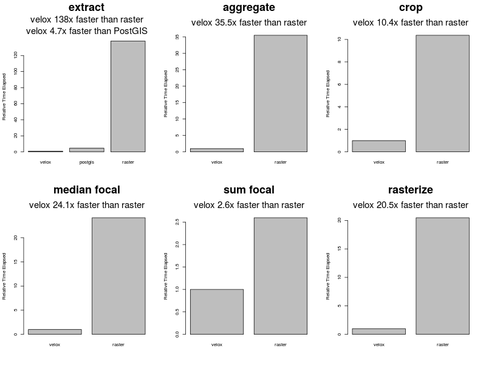

# velox

Velox is an R package for performing fast extraction and manipulation operations on geographic raster data. velox is fast because all raster computations are performed in C++ (using the excellent [Rcpp API](http://www.rcpp.org/)), and all data is held in memory. velox is intended to be used together with the [raster](https://cran.r-project.org/package=raster) package, to which it provides a straightforward interface.

Currently, the following operations are implemented in velox:
+ Focal value calculation (i.e. moving window filters)
+ Raster value extraction given polygons
+ Rasterization of polygons
+ Raster aggregation
+ Cropping
+ Image patch flattening (similar to Matlab's im2col) and reconstruction


## Installation

Velox should work on all major operating systems (Linux, Mac OS, Windows).

### Dependencies

For its read and write methods, velox requires the [rgdal](https://cran.r-project.org/package=rgdal) package, which relies on the external
GDAL (>= 1.6.3) and PROJ.4 (>= 4.4.9) libraries. 
On Debian/Ubuntu (>= 12.04), GDAL and PROJ.4 can be installbed by entering
```shell
sudo apt-get install libgdal-dev libproj-dev
```
in a terminal.
Further, velox depends on the [rgeos](https://cran.r-project.org/package=rgeos) package, which in turn requires the external GEOS library (>= 3.2.0).
To install GEOS on Debian/Ubuntu (>= 12.04), enter
```shell
sudo apt-get install libgeos-dev
```
in a terminal.

### R Package
Once the system dependencies are available, you can either install velox from CRAN
```R
install.packages("velox")
```
or you can install the development version using the `install_github` function from the [devtools](https://cran.r-project.org/package=devtools) package:
```R
library(devtools)
install_github("hunzikp/velox")
```


## Benchmarking

The following performance tests were peformed on a i7-4810MQ CPU at 2.80GHz, using `raster` 2.5-8, PostgreSQL 9.5 and PostGIS 2.2.
See [here](vignettes/benchmarking.R) for the underlying R script.




## Getting Started

### Creating `VeloxRaster` Objects

`VeloxRaster` objects are created with the `velox` function:
```R
library(velox)
library(raster)

## From GDAL readable raster file
vx1 <- velox("myraster.tif")

## From RasterLayer object
rl <- raster("myraster.tif")
vx2 <- velox(rl)

## From RasterStack object
rs <- stack("myraster.tif")
vx3 <- velox(rs)

## From matrix
mat <- matrix(1:100, 10, 10)
vx4 <- velox(mat, extent=c(0,1,0,1), res=c(0.1,0.1), crs="+proj=longlat +datum=WGS84 +no_defs")

## From list of matrices
mat.ls <- list(matrix(1:100, 10, 10), matrix(100:1, 10, 10))
vx5 <- velox(mat.ls, extent=c(0,1,0,1), res=c(0.1,0.1), crs="+proj=longlat +datum=WGS84 +no_defs")

## From list of VeloxRasters
vx.ls <- list(vx4, vx5)
vx6 <- velox(vx.ls)
```

### Manipulating `VeloxRaster` Objects

`VeloxRaster` objects are ReferenceClass objects and thus mutable:
```R
## Crop VeloxRaster
mat <- matrix(1:100, 10, 10)
vx <- velox(mat, extent=c(0,1,0,1), res=c(0.1,0.1), crs="+proj=longlat +datum=WGS84 +no_defs")
cropext <- c(0.3,0.7,0.3,0.7)
vx$crop(cropext)

> vx$extent
[1] 0.3 0.7 0.3 0.7
```
We can also aggregate a VeloxRaster...
```R
## Aggregate VeloxRaster
mat <- matrix(1:100, 10, 10)
vx <- velox(mat, extent=c(0,1,0,1), res=c(0.1,0.1), crs="+proj=longlat +datum=WGS84 +no_defs")
vx$aggregate(factor=c(2,2), aggtype="sum")
```
... or calculate focal values (i.e. apply a moving window filter):
```R
## Apply filter to VeloxRaster
mat <- matrix(1:100, 10, 10)
vx <- velox(mat, extent=c(0,1,0,1), res=c(0.1,0.1), crs="+proj=longlat +datum=WGS84 +no_defs")
vx$medianFocal(wrow=3, wcol=3, bands=1)
```

### Extracting raster values given polygons

```R
## Make VeloxRaster
mat <- matrix(1:100, 10, 10)
extent <- c(0,1,0,1)
vx <- velox(mat, extent=extent, res=c(0.1,0.1), crs="+proj=longlat +datum=WGS84 +no_defs")

## Make SpatialPolygonsDataFrame
library(sp)
library(rgeos)
set.seed(0)
coords <- cbind(runif(10, extent[1], extent[2]), runif(10, extent[3], extent[4]))
sp <- SpatialPoints(coords)
spol <- gBuffer(sp, width=0.2, byid=TRUE)
spdf <- SpatialPolygonsDataFrame(spol, data.frame(id=1:length(spol)), FALSE)

## Extract values and calculate mean
ex.mat <- vx$extract(spdf, fun=mean)
```

### Rasterizing polygons

```R
## Make VeloxRaster
mat <- matrix(0, 10, 10)
extent <- c(0,1,0,1)
vx <- velox(mat, extent=extent, res=c(0.1,0.1), crs="+proj=longlat +datum=WGS84 +no_defs")

## Make SpatialPolygonsDataFrame
library(sp)
library(rgeos)
set.seed(0)
coords <- cbind(runif(10, extent[1], extent[2]), runif(10, extent[3], extent[4]))
sp <- SpatialPoints(coords)
spol <- gBuffer(sp, width=0.05, byid=TRUE)
spdf <- SpatialPolygonsDataFrame(spol, data.frame(id=1:length(spol)), FALSE)

## Rasterize polygons using "id" column
vx$rasterize(spdf, field="id", band=1)
```

### `raster` interface

```R
## Make VeloxRaster with two bands
mat1 <- matrix(1, 10, 10)
mat2 <- matrix(2, 10, 10)
extent <- c(0,1,0,1)
vx <- velox(list(mat1, mat2), extent=extent, res=c(0.1,0.1), crs="+proj=longlat +datum=WGS84 +no_defs")

## Cast band 1 as RasterLayer
rl <- vx$as.RasterLayer(band=1)

## Cast both bands as RasterStack
rs <- vx$as.RasterStack()

## Back to VeloxRaster
vx2 <- velox(rs)
```

### Help

Because most of `velox`'s functionality comes in the form of `VeloxRaster` methods, accessing the help pages is performed as follows:

```R
## See all methods of VeloxRaster
?VeloxRaster

## See help for method 'extract'
?VeloxRaster_extract

## See help for method 'crop'
?VeloxRaster_crop

## etc...
```


